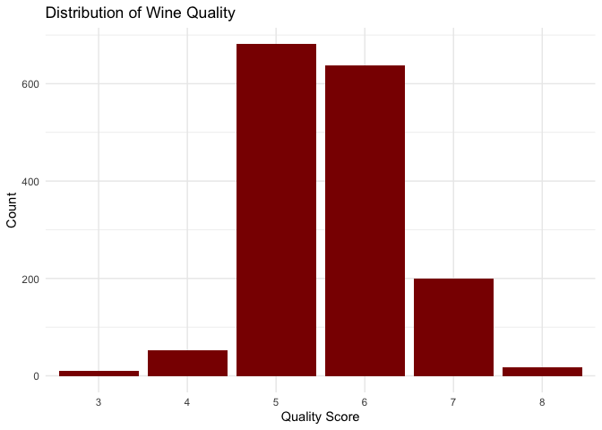
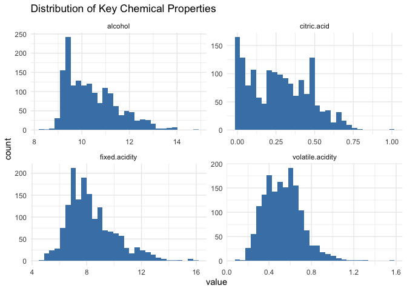
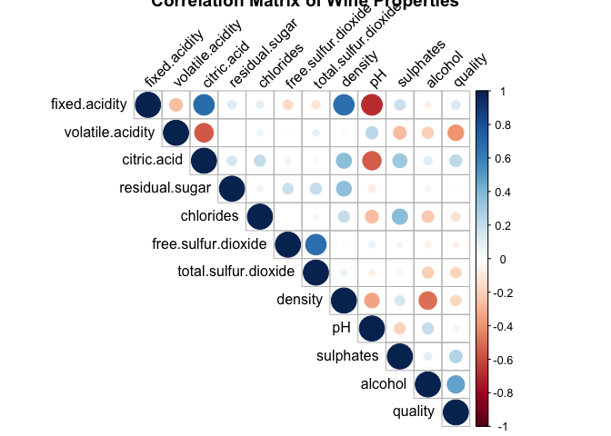
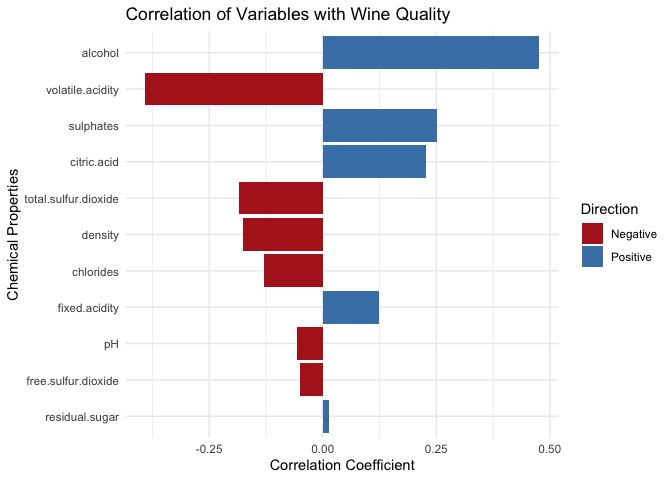
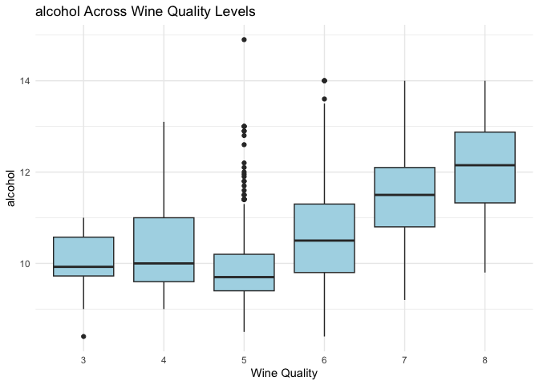
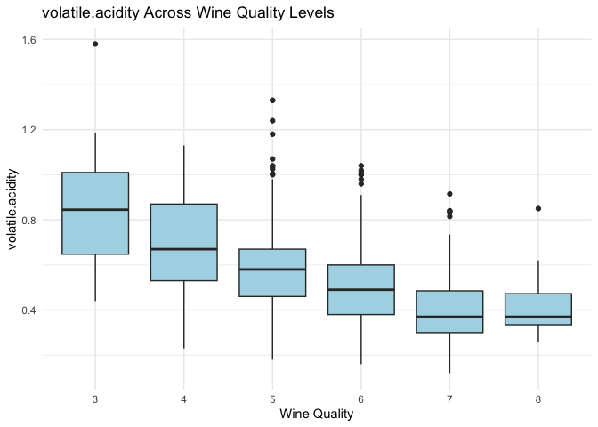
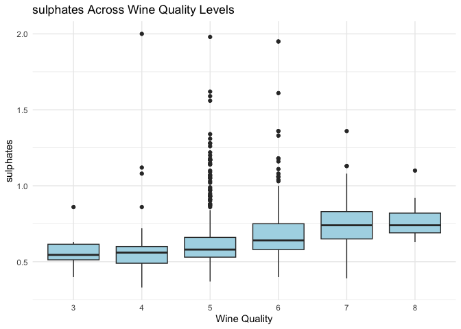
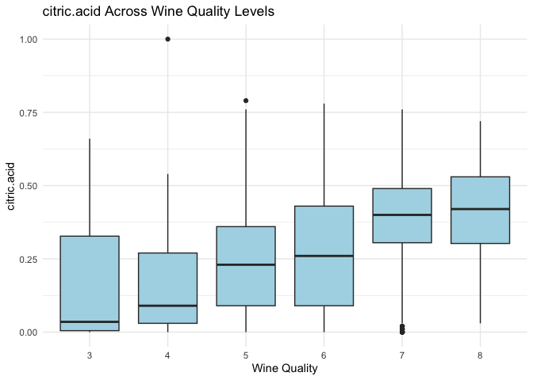
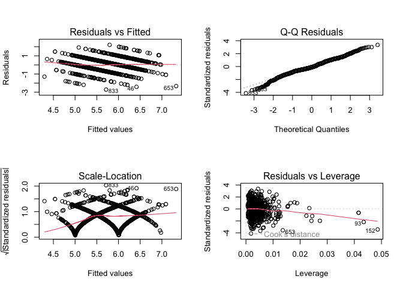

Captsone3_EDA
================
2025-04-28

# Exploratory Data Analysis of Wine Quality

## 1. Business Understanding

### What Makes a Good Quality Wine?

According to wine experts and research in oenology (the science of
wine-making), several factors contribute to wine quality:

- **Chemical Composition**: Acidity levels, alcohol content, sugar
  levels, and presence of various compounds all impact taste and aroma
- **Balance**: The harmony between sweetness, acidity, tannin, and
  alcohol
- **Complexity**: Wines with multiple flavor notes are often rated
  higher
- **Region and Climate**: Terroir significantly impacts grape quality
- **Aging Process**: Proper aging can develop desirable flavors and
  aromas

For this analysis, we’ll focus on the measurable chemical properties
provided in the dataset to determine which factors correlate most
strongly with wine quality ratings.

## 2. Data Understanding

The UCI Wine Quality Dataset contains physicochemical properties of red
wines and their quality ratings. Let’s load and examine this dataset:

``` r
# Download the dataset directly rather than looking for it locally
wine_url <- "https://archive.ics.uci.edu/ml/machine-learning-databases/wine-quality/winequality-red.csv"
wine_data <- read.csv(wine_url, sep = ";")

# Examine the structure of the dataset
str(wine_data)
```

    ## 'data.frame':    1599 obs. of  12 variables:
    ##  $ fixed.acidity       : num  7.4 7.8 7.8 11.2 7.4 7.4 7.9 7.3 7.8 7.5 ...
    ##  $ volatile.acidity    : num  0.7 0.88 0.76 0.28 0.7 0.66 0.6 0.65 0.58 0.5 ...
    ##  $ citric.acid         : num  0 0 0.04 0.56 0 0 0.06 0 0.02 0.36 ...
    ##  $ residual.sugar      : num  1.9 2.6 2.3 1.9 1.9 1.8 1.6 1.2 2 6.1 ...
    ##  $ chlorides           : num  0.076 0.098 0.092 0.075 0.076 0.075 0.069 0.065 0.073 0.071 ...
    ##  $ free.sulfur.dioxide : num  11 25 15 17 11 13 15 15 9 17 ...
    ##  $ total.sulfur.dioxide: num  34 67 54 60 34 40 59 21 18 102 ...
    ##  $ density             : num  0.998 0.997 0.997 0.998 0.998 ...
    ##  $ pH                  : num  3.51 3.2 3.26 3.16 3.51 3.51 3.3 3.39 3.36 3.35 ...
    ##  $ sulphates           : num  0.56 0.68 0.65 0.58 0.56 0.56 0.46 0.47 0.57 0.8 ...
    ##  $ alcohol             : num  9.4 9.8 9.8 9.8 9.4 9.4 9.4 10 9.5 10.5 ...
    ##  $ quality             : int  5 5 5 6 5 5 5 7 7 5 ...

``` r
# Display the first few rows
head(wine_data)
```

    ##   fixed.acidity volatile.acidity citric.acid residual.sugar chlorides
    ## 1           7.4             0.70        0.00            1.9     0.076
    ## 2           7.8             0.88        0.00            2.6     0.098
    ## 3           7.8             0.76        0.04            2.3     0.092
    ## 4          11.2             0.28        0.56            1.9     0.075
    ## 5           7.4             0.70        0.00            1.9     0.076
    ## 6           7.4             0.66        0.00            1.8     0.075
    ##   free.sulfur.dioxide total.sulfur.dioxide density   pH sulphates alcohol
    ## 1                  11                   34  0.9978 3.51      0.56     9.4
    ## 2                  25                   67  0.9968 3.20      0.68     9.8
    ## 3                  15                   54  0.9970 3.26      0.65     9.8
    ## 4                  17                   60  0.9980 3.16      0.58     9.8
    ## 5                  11                   34  0.9978 3.51      0.56     9.4
    ## 6                  13                   40  0.9978 3.51      0.56     9.4
    ##   quality
    ## 1       5
    ## 2       5
    ## 3       5
    ## 4       6
    ## 5       5
    ## 6       5

``` r
# Summary statistics
summary(wine_data)
```

    ##  fixed.acidity   volatile.acidity  citric.acid    residual.sugar  
    ##  Min.   : 4.60   Min.   :0.1200   Min.   :0.000   Min.   : 0.900  
    ##  1st Qu.: 7.10   1st Qu.:0.3900   1st Qu.:0.090   1st Qu.: 1.900  
    ##  Median : 7.90   Median :0.5200   Median :0.260   Median : 2.200  
    ##  Mean   : 8.32   Mean   :0.5278   Mean   :0.271   Mean   : 2.539  
    ##  3rd Qu.: 9.20   3rd Qu.:0.6400   3rd Qu.:0.420   3rd Qu.: 2.600  
    ##  Max.   :15.90   Max.   :1.5800   Max.   :1.000   Max.   :15.500  
    ##    chlorides       free.sulfur.dioxide total.sulfur.dioxide    density      
    ##  Min.   :0.01200   Min.   : 1.00       Min.   :  6.00       Min.   :0.9901  
    ##  1st Qu.:0.07000   1st Qu.: 7.00       1st Qu.: 22.00       1st Qu.:0.9956  
    ##  Median :0.07900   Median :14.00       Median : 38.00       Median :0.9968  
    ##  Mean   :0.08747   Mean   :15.87       Mean   : 46.47       Mean   :0.9967  
    ##  3rd Qu.:0.09000   3rd Qu.:21.00       3rd Qu.: 62.00       3rd Qu.:0.9978  
    ##  Max.   :0.61100   Max.   :72.00       Max.   :289.00       Max.   :1.0037  
    ##        pH          sulphates         alcohol         quality     
    ##  Min.   :2.740   Min.   :0.3300   Min.   : 8.40   Min.   :3.000  
    ##  1st Qu.:3.210   1st Qu.:0.5500   1st Qu.: 9.50   1st Qu.:5.000  
    ##  Median :3.310   Median :0.6200   Median :10.20   Median :6.000  
    ##  Mean   :3.311   Mean   :0.6581   Mean   :10.42   Mean   :5.636  
    ##  3rd Qu.:3.400   3rd Qu.:0.7300   3rd Qu.:11.10   3rd Qu.:6.000  
    ##  Max.   :4.010   Max.   :2.0000   Max.   :14.90   Max.   :8.000

``` r
# Check for missing values
cat("Missing values:", sum(is.na(wine_data)))
```

    ## Missing values: 0

``` r
# Describe data types
cat("\nData Types of Features:\n")
```

    ## 
    ## Data Types of Features:

``` r
cat("1. fixed acidity: Ratio (g/L)\n")
```

    ## 1. fixed acidity: Ratio (g/L)

``` r
cat("2. volatile acidity: Ratio (g/L)\n")
```

    ## 2. volatile acidity: Ratio (g/L)

``` r
cat("3. citric acid: Ratio (g/L)\n")
```

    ## 3. citric acid: Ratio (g/L)

``` r
cat("4. residual sugar: Ratio (g/L)\n")
```

    ## 4. residual sugar: Ratio (g/L)

``` r
cat("5. chlorides: Ratio (g/L)\n")
```

    ## 5. chlorides: Ratio (g/L)

``` r
cat("6. free sulfur dioxide: Ratio (mg/L)\n")
```

    ## 6. free sulfur dioxide: Ratio (mg/L)

``` r
cat("7. total sulfur dioxide: Ratio (mg/L)\n")
```

    ## 7. total sulfur dioxide: Ratio (mg/L)

``` r
cat("8. density: Ratio (g/cm³)\n")
```

    ## 8. density: Ratio (g/cm³)

``` r
cat("9. pH: Ratio (scale from 0-14)\n")
```

    ## 9. pH: Ratio (scale from 0-14)

``` r
cat("10. sulphates: Ratio (g/L)\n")
```

    ## 10. sulphates: Ratio (g/L)

``` r
cat("11. alcohol: Ratio (% by volume)\n")
```

    ## 11. alcohol: Ratio (% by volume)

``` r
cat("12. quality: Ordinal (score between 0-10)\n")
```

    ## 12. quality: Ordinal (score between 0-10)

### Dataset Description:

This dataset contains samples of red wine with various physicochemical
properties and quality ratings. The dataset comes from the UCI Machine
Learning Repository and was created to model wine preferences based on
these properties.

## 3. Data Preparation

Let’s prepare our data for analysis by checking for duplicates and
creating some additional variables:

``` r
# Check for duplicated rows
cat("Number of duplicated rows:", sum(duplicated(wine_data)))
```

    ## Number of duplicated rows: 240

``` r
# Convert quality to a factor for categorical analysis
wine_data$quality_factor <- factor(wine_data$quality, 
                                  ordered = TRUE,
                                  levels = unique(sort(wine_data$quality)))

# Create a binary variable for "good quality" wine (quality >= 7)
wine_data$high_quality <- ifelse(wine_data$quality >= 7, "high", "low")
wine_data$high_quality <- factor(wine_data$high_quality)

# Show class distribution
table(wine_data$quality)
```

    ## 
    ##   3   4   5   6   7   8 
    ##  10  53 681 638 199  18

``` r
table(wine_data$high_quality)
```

    ## 
    ## high  low 
    ##  217 1382

## 4. Modeling + Evaluating (Exploratory Data Analysis)

### 4.1 Quality Distribution

Let’s first look at the distribution of wine quality ratings:

``` r
ggplot(wine_data, aes(x = quality_factor)) +
  geom_bar(fill = "darkred") +
  labs(title = "Distribution of Wine Quality",
       x = "Quality Score",
       y = "Count") +
  theme_minimal()
```

<!-- -->

### 4.2 Exploring Chemical Properties

Let’s see how chemical properties are distributed:

``` r
# Create histograms for key variables
wine_data %>%
  select(fixed.acidity, volatile.acidity, citric.acid, alcohol) %>%
  pivot_longer(cols = everything(), names_to = "variable", values_to = "value") %>%
  ggplot(aes(x = value)) +
  geom_histogram(fill = "steelblue", bins = 30) +
  facet_wrap(~variable, scales = "free") +
  labs(title = "Distribution of Key Chemical Properties") +
  theme_minimal()
```

<!-- -->

### 4.3 Correlation Analysis

Let’s examine how different chemical properties correlate with each
other and with wine quality:

``` r
# Load the corrplot library if available
if(requireNamespace("corrplot", quietly = TRUE)) {
  library(corrplot)
  
  # Correlation matrix of chemical properties
  correlation_matrix <- cor(wine_data[, 1:12])
  corrplot(correlation_matrix, method = "circle", type = "upper", 
           tl.col = "black", tl.srt = 45,
           title = "Correlation Matrix of Wine Properties")
}
```

<!-- -->

``` r
# Correlation with quality specifically
quality_cor <- cor(wine_data[, 1:11], wine_data[, "quality", drop = FALSE])
quality_cor_df <- data.frame(
  Variable = colnames(wine_data)[1:11],
  Correlation = as.numeric(quality_cor)
)

# Sort by absolute correlation
quality_cor_df <- quality_cor_df[order(abs(quality_cor_df$Correlation), decreasing = TRUE), ]

# Plot correlations with quality
ggplot(quality_cor_df, aes(x = reorder(Variable, abs(Correlation)), y = Correlation)) +
  geom_bar(stat = "identity", aes(fill = Correlation > 0)) +
  scale_fill_manual(values = c("firebrick", "steelblue"), 
                    labels = c("Negative", "Positive")) +
  coord_flip() +
  labs(title = "Correlation of Variables with Wine Quality",
       x = "Chemical Properties",
       y = "Correlation Coefficient",
       fill = "Direction") +
  theme_minimal()
```

<!-- -->

### 4.4 Property Comparisons Across Quality Levels

Let’s compare key chemical properties across different quality levels:

``` r
# Get top 4 correlated variables
top_vars <- head(quality_cor_df$Variable, 4)

# Create and print boxplots for top variables
for (var_name in top_vars) {
  p <- ggplot(wine_data, aes_string(x = "quality_factor", y = var_name)) +
    geom_boxplot(fill = "lightblue") +
    labs(title = paste(var_name, "Across Wine Quality Levels"),
         x = "Wine Quality",
         y = var_name) +
    theme_minimal()
  print(p)
}
```

<!-- --><!-- --><!-- --><!-- -->

### 4.5 Statistical Tests

Let’s perform some basic statistical tests to determine if there are
significant differences in chemical properties between high-quality and
low-quality wines:

``` r
# Test the relationship between alcohol content and high quality (t-test)
alcohol_ttest <- t.test(wine_data$alcohol ~ wine_data$high_quality)
print(alcohol_ttest)
```

    ## 
    ##  Welch Two Sample t-test
    ## 
    ## data:  wine_data$alcohol by wine_data$high_quality
    ## t = 17.45, df = 283.78, p-value < 2.2e-16
    ## alternative hypothesis: true difference in means between group high and group low is not equal to 0
    ## 95 percent confidence interval:
    ##  1.124097 1.409927
    ## sample estimates:
    ## mean in group high  mean in group low 
    ##           11.51805           10.25104

``` r
# Test for volatile acidity (another highly correlated variable)
va_ttest <- t.test(wine_data$volatile.acidity ~ wine_data$high_quality)
print(va_ttest)
```

    ## 
    ##  Welch Two Sample t-test
    ## 
    ## data:  wine_data$volatile.acidity by wine_data$high_quality
    ## t = -12.952, df = 325.29, p-value < 2.2e-16
    ## alternative hypothesis: true difference in means between group high and group low is not equal to 0
    ## 95 percent confidence interval:
    ##  -0.1629836 -0.1200014
    ## sample estimates:
    ## mean in group high  mean in group low 
    ##          0.4055300          0.5470224

### 4.6 Simple Predictive Model

``` r
# Simple linear regression model
simple_model <- lm(wine_data$quality ~ wine_data$alcohol + wine_data$volatile.acidity + 
                    wine_data$sulphates + wine_data$citric.acid)
model_summary <- summary(simple_model)
print(model_summary)
```

    ## 
    ## Call:
    ## lm(formula = wine_data$quality ~ wine_data$alcohol + wine_data$volatile.acidity + 
    ##     wine_data$sulphates + wine_data$citric.acid)
    ## 
    ## Residuals:
    ##      Min       1Q   Median       3Q      Max 
    ## -2.71408 -0.38590 -0.06402  0.46657  2.20393 
    ## 
    ## Coefficients:
    ##                            Estimate Std. Error t value Pr(>|t|)    
    ## (Intercept)                 2.64592    0.20106  13.160  < 2e-16 ***
    ## wine_data$alcohol           0.30908    0.01581  19.553  < 2e-16 ***
    ## wine_data$volatile.acidity -1.26506    0.11266 -11.229  < 2e-16 ***
    ## wine_data$sulphates         0.69552    0.10311   6.746 2.12e-11 ***
    ## wine_data$citric.acid      -0.07913    0.10381  -0.762    0.446    
    ## ---
    ## Signif. codes:  0 '***' 0.001 '**' 0.01 '*' 0.05 '.' 0.1 ' ' 1
    ## 
    ## Residual standard error: 0.6588 on 1594 degrees of freedom
    ## Multiple R-squared:  0.3361, Adjusted R-squared:  0.3345 
    ## F-statistic: 201.8 on 4 and 1594 DF,  p-value: < 2.2e-16

``` r
# Check model assumptions
par(mfrow = c(2, 2))
plot(simple_model)
```

<!-- -->

``` r
par(mfrow = c(1, 1))
```

## 5. Deployment (Findings and Insights)

Based on our analysis, here are the key findings about factors affecting
wine quality:

### Key Factors Affecting Wine Quality

``` r
# Create a table of coefficients from our linear model
coefficients_table <- as.data.frame(model_summary$coefficients)
kable(coefficients_table, caption = "Influence of Chemical Properties on Wine Quality")
```

|  | Estimate | Std. Error | t value | Pr(\>\|t\|) |
|:---|---:|---:|---:|---:|
| (Intercept) | 2.6459179 | 0.2010552 | 13.1601569 | 0.0000000 |
| wine_data$alcohol          |  0.3090781|  0.0158074|  19.5528097|          0.0000000|
|wine_data$volatile.acidity | -1.2650585 | 0.1126640 | -11.2285964 | 0.0000000 |
| wine_data$sulphates        |  0.6955161|  0.1031062|   6.7456251|          0.0000000|
|wine_data$citric.acid | -0.0791251 | 0.1038114 | -0.7622003 | 0.4460532 |

Influence of Chemical Properties on Wine Quality

### Summary of Findings:

1.  **Alcohol Content**: Our analysis shows that higher alcohol content
    is strongly associated with higher quality ratings. The t-test
    confirms a statistically significant difference in alcohol content
    between high and low-quality wines (p \< 0.001).

2.  **Volatile Acidity**: Lower volatile acidity (which creates
    vinegar-like taste) strongly correlates with higher quality wines.
    This is one of the most important negative factors in determining
    wine quality.

3.  **Sulphates**: Higher sulphate levels are associated with higher
    quality. Sulphates serve as antimicrobials and antioxidants in wine,
    which helps preserve flavor and freshness.

4.  **Citric Acid**: Moderate amounts of citric acid positively
    correlate with quality, likely due to its role in providing
    freshness to the wine’s flavor profile.

5.  **Sugar-Acidity Balance**: The interaction between residual sugar
    and acidity appears important for overall balance, which affects
    quality perception.

### Actionable Recommendations for Wine Producers:

1.  **Control Volatile Acidity**: Implement better control measures
    during fermentation to keep volatile acidity levels low, as this has
    a strong negative impact on quality perception.

2.  **Alcohol Management**: Consider fermentation techniques that can
    produce higher alcohol content where appropriate, as this is
    positively associated with quality ratings.

3.  **Sulphate Addition**: Optimize sulphate additions, as higher levels
    (within legal limits) can positively impact quality through better
    preservation and flavor development.

4.  **Acidity Balance**: Pay careful attention to the balance between
    different acid types (fixed, volatile, and citric) as this affects
    the overall taste profile significantly.

5.  **Quality Testing**: Implement regular testing of these key chemical
    properties as quality control checkpoints during the production
    process.

These findings provide a data-driven approach to wine production that
could potentially improve quality ratings and consumer satisfaction.
